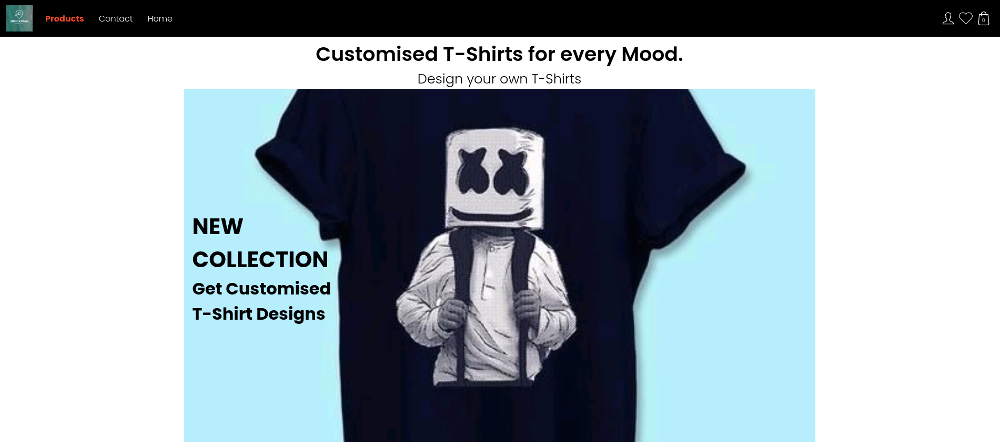
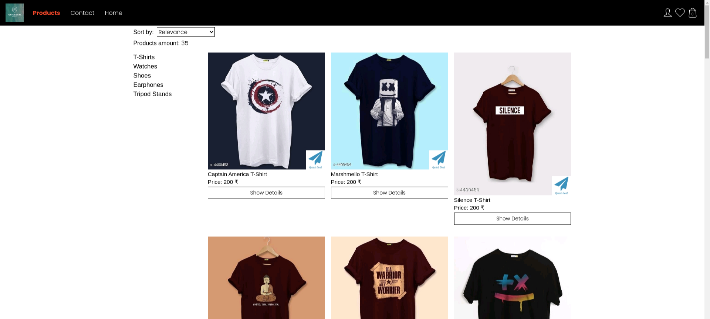

## Overview
Full stack project with authentication and database fired on firebase. The user can browse product lists using the filtering and product preview tools, choose the size and add selected products to the cart and wishlist. Next, after sign in/log in he can send an order and view all orders on the list of orders.

## Used technologies

- React & Redux on frontend. 
- Firebase on backend (storing data and authentication). 

## Preview

You can see this app in action.  
https://quickdeal-5f2a6.web.app/

This project was bootstrapped with [Create React App](https://github.com/facebook/create-react-app).
